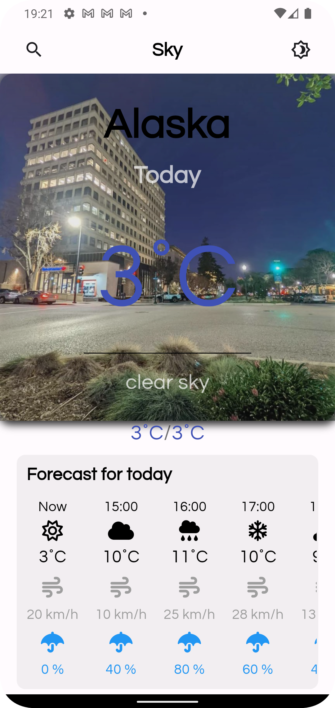
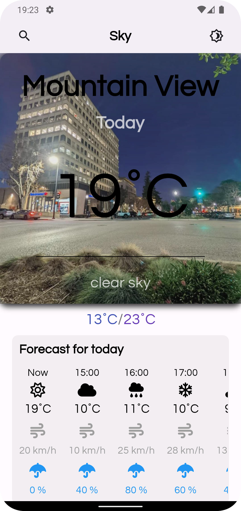

# Sky Weather App 🌦️

A modern weather app developed with Flutter and connected to the **OpenWeather API**. It features a beautiful design and provides weather data, including current conditions, minimum and maximum temperatures, chance of rain, and wind speed. Additionally, it uses the Google Places API to fetch images for locations based on the search text.

## 📑Table of Contents
- [Screenshots](#screenshots)
- [Dependencies](#dependencies)
- [Installation](#installation)
- [Features](#features)
- [To-Do](#to-do)
- [Usage](#usage)
- [Known Issues](#known-issues)

## 📌 Screenshots
<div style="display:flex; justify-content:center;">
    
    
    
</div>

## 🔗 Dependencies
To use this app, you need to have the following dependencies installed:

```yaml
dependencies:
  cool_alert: ^2.0.1
  flutter:
    sdk: flutter
  flutter_lints: ^3.0.2
  fluttertoast: ^8.2.5
  font_awesome_flutter: ^10.7.0
  geocoding: ^3.0.0
  geolocator: ^11.0.0
  google_fonts: ^6.2.1
  status_alert: ^1.0.1
```

```yaml
fonts:
  - family: WeatherIcons
    fonts:
      - asset: fonts/weathericons-regular.ttf
```

## 🚀 Installation

1. Clone the repository:
```bash
git clone https://github.com/your/repository.git
```
2. Navigate to the project directory:
```bash

cd sky_weather_app
```
3. Install the dependencies:
```bash
flutter pub get
```
4. Run the app:
```bash
flutter run
```

## ✨ Features
- Display current weather conditions
- Show minimum and maximum temperatures
- Indicate chance of rain and wind speed
- Fetch images using **Google Places API** based on search text

## 📝 To-Do
- Implement dark-light mode switching
- Fix the Google Places API bug
- Add weather data for the next 7 days
- Display hourly weather data until 00:00 of the next day 

## 🛠️ Usage
Simply open the app and enter the location you want to check the weather for. The app will display the weather data along with an image of the location.

## ⚠️ Known Issues
The Google Places API currently stores only the first image and does not update subsequently. This issue is yet to be resolved.
